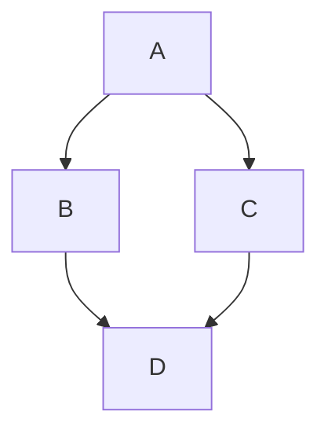

# 마크다운 에디터 사용자 설명서 (User Manual)

마크다운 에디터를 사용해 주셔서 감사합니다! 
이 프로그램은 가볍고 빠르며, 여러분의 문서를 쉽게 작성하고, 체계적으로 관리하며, 깔끔하게 출력(PDF 내보내기)할 수 있도록 돕는 데스크톱 애플리케이션입니다.

## 1. 화면 구성 안내 (UI)

에디터 화면은 크게 4가지 주요 영역으로 나뉩니다:
1. **상단 툴바 (Toolbar)**: 새 파일 생성, 열기, 저장, 인쇄 등의 파일 관리 기능과 화면 뷰 모드(소스, 분할, 뷰어) 전환 버튼이 위치해 있습니다.
2. **에디터 영역 (좌측)**: 마크다운 코드를 직접 입력하는 공간입니다. 개발용 에디터처럼 문법이 색상으로 강조되며, 다양한 단축키를 사용할 수 있습니다.
3. **미리보기 뷰어 영역 (우측)**: 좌측에서 작성한 마크다운 문서가 실시간으로 변환되어 예쁘게 보이는 공간입니다. 
4. **목차(Outline) 사이드바 (가장 좌측)**: 문서 내에 작성된 모든 제목(Heading)을 분석하여 한눈에 볼 수 있는 목차를 제공합니다. 클릭하면 해당 위치로 즉시 이동합니다.

## 2. 단축키 모음 (Cheat Sheet)

프로그램 사용 중 언제라도 상단 툴바의 **`❓ Help`** 버튼을 누르거나 키보드의 **`F1`** 키를 누르면 아래의 단축키 목록 팝업창을 띄워 볼 수 있습니다.

### 파일 관리
- **새 파일 만들기**: `Ctrl + N`
- **파일 열기**: `Ctrl + O`
- **저장**: `Ctrl + S`
- **다른 이름으로 저장**: `Ctrl + Shift + S`
- **인쇄 및 PDF 내보내기**: `Ctrl + P`

### 텍스트 서식 지정
- **제목(H1~H6) 설정**: `Ctrl + 1~6` (키보드 환경에 따라 작동하지 않을 경우 `Alt + 1~6` 사용 가능)
  - *팁: 서식이 적용된 줄에서 단축키를 한 번 더 누르면 서식이 해제(Toggle)됩니다.*
- **굵게 (Bold)**: `Ctrl + B` (스마트 토글 지원)
- **기울임꼴 (Italic)**: `Ctrl + I` (스마트 토글 지원)
- **코드 블록 삽입**: `Ctrl + Shift + C` (스마트 토글 지원)
  - *팁: 단어를 드래그하고 `Ctrl+B`를 누르면 굵게 변하고, 굵게 변한 단어를 다시 선택해 누르면 원래대로 돌아옵니다.*
- **표(Table) 삽입**: `Ctrl + T` (몇 줄, 몇 칸짜리 표를 만들지 입력하는 창이 열립니다)

### 화면 설정 및 조작
- **목차(Outline) 창 열기/닫기**: `Ctrl + \` (역슬래시)
- **화면 뷰 모드 순환**: `Ctrl + M` (분할 뷰 → 소스코드 뷰 → 미리보기 뷰 순서로 전환)
- **팝업/모달 창 닫기**: `Esc`

## 3. 핵심 고급 기능 가이드

### 3.1 코드 구문 강조 (Syntax Highlighting)
프로그래밍 코드를 문서에 넣을 때, 3개의 백틱(```` ` ````) 뒤에 프로그래밍 언어의 이름을 영어로 적어주시면 화려한 색상으로 코드가 구분되어 보입니다.
**작성 예시:**
```java
public class Main {
    public static void main(String[] args) {
        System.out.println("Hello");
    }
}
```

### 3.2 Mermaid 다이어그램 및 순서도 렌더링
문서 내에 복잡한 순서도나 다이어그램을 코드로 직접 그릴 수 있습니다. 언어 이름을 `mermaid`로 지정해 보세요.
**작성 예시:**


### 3.3 드래그 앤 드롭 파일 열기
바탕화면이나 탐색기에 있는 `.md` 확장자 파일을 마우스로 끌어서 프로그램 화면 아무 곳에나 툭 떨어뜨리면(Drag & Drop) 내용이 즉시 열립니다. 파일 열기 버튼을 누를 필요가 없어 매우 편리합니다.

### 3.4 깔끔하게 PDF로 내보내기 (Print)
`Ctrl + P` 단축키를 누르거나 상단의 Print 버튼을 누르면 인쇄 모드로 진입합니다. 
이때 사이드바나 툴바 같은 거추장스러운 버튼들은 자동으로 숨겨지고, 백색 배경에 텍스트만 깔끔하게 정렬된 상태로 출력됩니다. 시스템의 인쇄 창에서 **"PDF로 저장"** 을 선택하시면 고품질의 PDF 파일로 문서를 소장할 수 있습니다.
