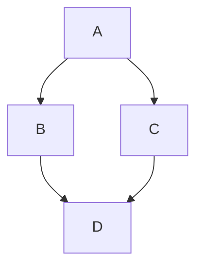

# 마크다운 에디터 사용자 설명서 (User Manual)

마크다운 에디터를 사용해 주셔서 감사합니다! 
이 프로그램은 가볍고 빠르며, 여러분의 문서를 쉽게 작성하고, 체계적으로 관리하며, 깔끔하게 출력(PDF 내보내기)할 수 있도록 돕는 데스크톱 애플리케이션입니다.

## 1. 화면 구성 안내 (UI)

에디터 화면은 크게 4가지 주요 영역으로 나뉩니다:
1. **상단 툴바 (Toolbar)**: 새 파일 생성, 열기, 저장, 인쇄 등의 파일 관리 기능과 화면 뷰 모드(소스, 분할, 뷰어) 전환 버튼이 위치해 있습니다.
2. **에디터 영역 (좌측)**: 마크다운 코드를 직접 입력하는 공간입니다. 개발용 에디터처럼 문법이 색상으로 강조되며, 다양한 단축키를 사용할 수 있습니다.
3. **미리보기 뷰어 영역 (우측)**: 좌측에서 작성한 마크다운 문서가 실시간으로 변환되어 예쁘게 보이는 공간입니다. 
4. **다중 탭 사이드바 (가장 좌측)**: 문서 내 제목을 분석해 보여주는 '목차(Outline)' 탭과 현재 폴더 내 파일을 보여주는 '파일 탐색기(Explorer)' 탭을 제공합니다. 마우스를 이용해 사이드바 너비를 드래그하여 조절할 수 있습니다.

## 2. 단축키 모음 (Cheat Sheet)

프로그램 사용 중 언제라도 상단 툴바의 **`❓ Help`** 버튼을 누르거나 키보드의 **`F1`** 키를 누르면 아래의 단축키 목록 팝업창을 띄워 볼 수 있습니다.

### 파일 관리
- **새 파일 만들기**: `Ctrl + N`
- **파일 열기**: `Ctrl + O`
- **저장**: `Ctrl + S`
- **다른 이름으로 저장**: `Ctrl + Shift + S`
- **인쇄 및 PDF 내보내기**: `Ctrl + P`

### 텍스트 서식 지정
- **제목(H1~H6) 설정**: `Ctrl + 1~6` (키보드 환경에 따라 작동하지 않을 경우 `Alt + 1~6` 사용 가능)
  - *팁: 서식이 적용된 줄에서 단축키를 한 번 더 누르면 서식이 해제(Toggle)됩니다.*
- **굵게 (Bold)**: `Ctrl + B` (스마트 토글 지원)
- **기울임꼴 (Italic)**: `Ctrl + I` (스마트 토글 지원)
- **코드 블록 삽입**: `Ctrl + Shift + C` (스마트 토글 지원)
- **이미지 붙여넣기**: 클립보드에 복사된 이미지를 `Ctrl + V`로 붙여넣으면 로컬 폴더에 이미지를 자동 저장하고 삽입합니다. (※ 문서를 1회 이상 저장한 상태에서만 지원됩니다.)
  - *팁: 단어를 드래그하고 `Ctrl+B`를 누르면 굵게 변하고, 굵게 변한 단어를 다시 선택해 누르면 원래대로 돌아옵니다.*
- **표(Table) 삽입**: `Ctrl + T` (몇 줄, 몇 칸짜리 표를 만들지 입력하는 창이 열립니다)

### 화면 설정 및 조작
- **검색 위젯 열기**: `Ctrl + F` (강력한 텍스트 검색 및 치환 지원)
- **사이드바 열기/닫기**: `Ctrl + \` (역슬래시)
- **목차(Outline) 탭 열기**: `Ctrl + Shift + O`
- **탐색기(Explorer) 탭 열기**: `Ctrl + Shift + E`
- **다크 모드 전환**: `Ctrl + Shift + D`
- **화면 뷰 모드 순환**: `Ctrl + M` (분할 뷰 → 소스코드 뷰 → 미리보기 뷰 순서로 전환)
- **팝업/모달 창 닫기**: `Esc`

## 3. 핵심 고급 기능 가이드

### 3.1 코드 구문 강조 (Syntax Highlighting)
프로그래밍 코드를 문서에 넣을 때, 3개의 백틱(```` ` ````) 뒤에 프로그래밍 언어의 이름을 영어로 적어주시면 화려한 색상으로 코드가 구분되어 보입니다.
**작성 예시:**
```java
public class Main {
    public static void main(String[] args) {
        System.out.println("Hello");
    }
}
```

### 3.2 Mermaid 다이어그램 및 순서도 렌더링
문서 내에 복잡한 순서도나 다이어그램을 코드로 직접 그릴 수 있습니다. 언어 이름을 `mermaid`로 지정해 보세요.
**작성 예시:**


### 3.3 로컬 이미지 자동 저장 및 드래그 앤 드롭
이미지 파일을 문서에 넣고 싶을 때, 사진 파일을 복사해서 에디터에 `Ctrl+V` 로 붙여넣거나 화면에 끌어다 놓기만 하면(Drag & Drop) 프로그램이 알아서 현재 마크다운 파일 근처에 `images/` 폴더를 만들고 사진을 저장한 뒤 텍스트로 변환해 줍니다. 
(단, 이미지가 저장될 위치를 알아야 하므로 문서를 파일로 **저장한 상태(파일 경로가 존재하는 상태)**에서만 작동합니다.)

바탕화면이나 탐색기에 있는 `.md` 확장자 텍스트 파일 역시 에디터 화면에 툭 떨어뜨리면 내용이 즉시 열립니다.

### 3.4 수학 수식 렌더링 (Math & KaTeX)
문서에 복잡한 수식이나 기호를 입력하고 싶다면 `$` 또는 `$$` 문법을 활용하세요. KaTeX 렌더링 엔진을 통해 과학, 수학 문서를 미려하게 작성할 수 있습니다.
- **인라인 수식 (문장 내 포함)**: `$\pi r^2$`와 같이 작성합니다.
- **블록 수식 (단독 줄)**: 
```latex
$$
f(x) = \int_{-\infty}^\infty \hat f(\xi)\,e^{2 \pi i \xi x} \,d\xi
$$
```

### 3.5 다크 모드 (Dark Theme)
눈의 피로를 덜어주는 야간 모드가 탑재되어 있습니다. 에디터 툴바의 **[☀️ Light / 🌙 Dark]** 버튼을 클릭하거나, 단축키 `Ctrl + Shift + D`를 눌러 즉시 변경할 수 있습니다. 다크 모드 전환 시 시스템 소스코드 테마도 어두운 계열에 맞게 자동으로 최적화됩니다.

### 3.6 사이드바 파일 탐색기 (Explorer)
문서를 저장하거나 불러오면 사이드바의 **[Explorer]** 탭이 활성화됩니다.
- 현재 문서가 위치한 폴더(디렉토리) 내부의 마크다운(`.md`) 파일 및 텍스트 파일들이 자동으로 표시됩니다.
- 목록에서 다른 문서를 클릭하면, **현재 작성 중인 문서를 안전하게 자동 저장**한 후 해당 문서로 즉각 이동합니다.
- 사이드바 경계선을 마우스로 드래그하여 패널 너비를 사용자 환경에 맞게 늘리거나 줄일 수 있습니다.

### 3.7 깔끔하게 PDF로 내보내기 (Print)
`Ctrl + P` 단축키를 누르거나 상단의 Print 버튼을 누르면 인쇄 모드로 진입합니다. 
이때 사이드바나 툴바 같은 거추장스러운 버튼들은 자동으로 숨겨지고, 백색 배경에 텍스트만 깔끔하게 정렬된 상태로 출력됩니다. 시스템의 인쇄 창에서 **"PDF로 저장"** 을 선택하시면 고품질의 PDF 파일로 문서를 소장할 수 있습니다.

### 3.8 안전한 파일 관리 (보안 기능)
이 에디터는 사용자 PC의 시스템 보호를 위해 강력한 보안 샌드박스가 적용되어 있습니다. 출처가 불분명한 외부 마크다운 파일을 열더라도 악성 스크립트(XSS)가 실행되지 않도록 철저히 차단(DOMPurify)합니다. 
또한 시스템 중요 파일 보호를 위해 에디터에서는 **`.md`, `.txt`, `.markdown`** 확장자를 가진 안전한 텍스트 파일만 열고 저장할 수 있도록 제한하고 있으니, 안심하고 사용하셔도 좋습니다.
